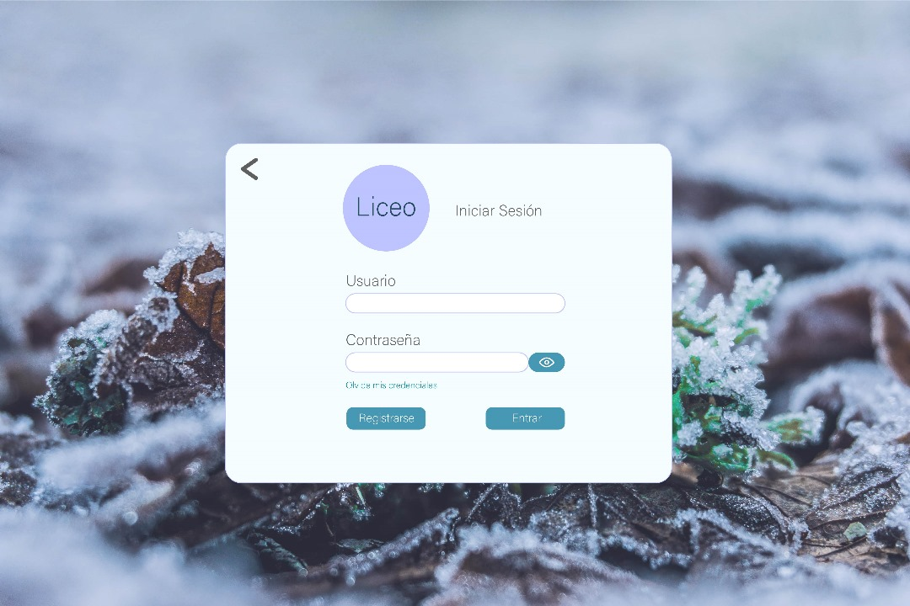
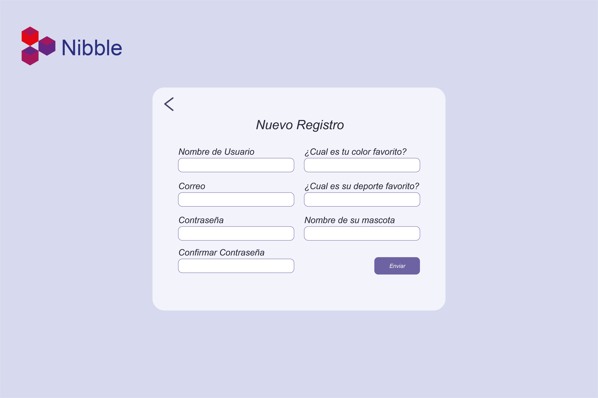
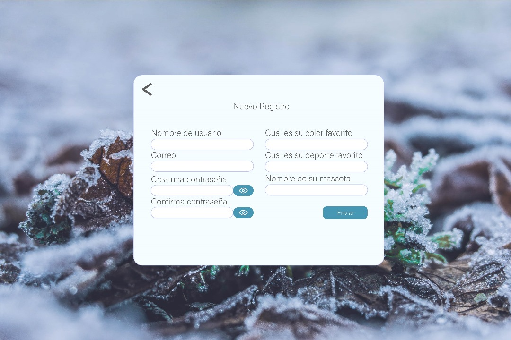
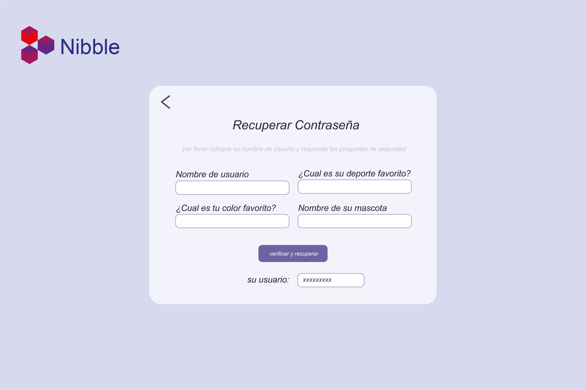
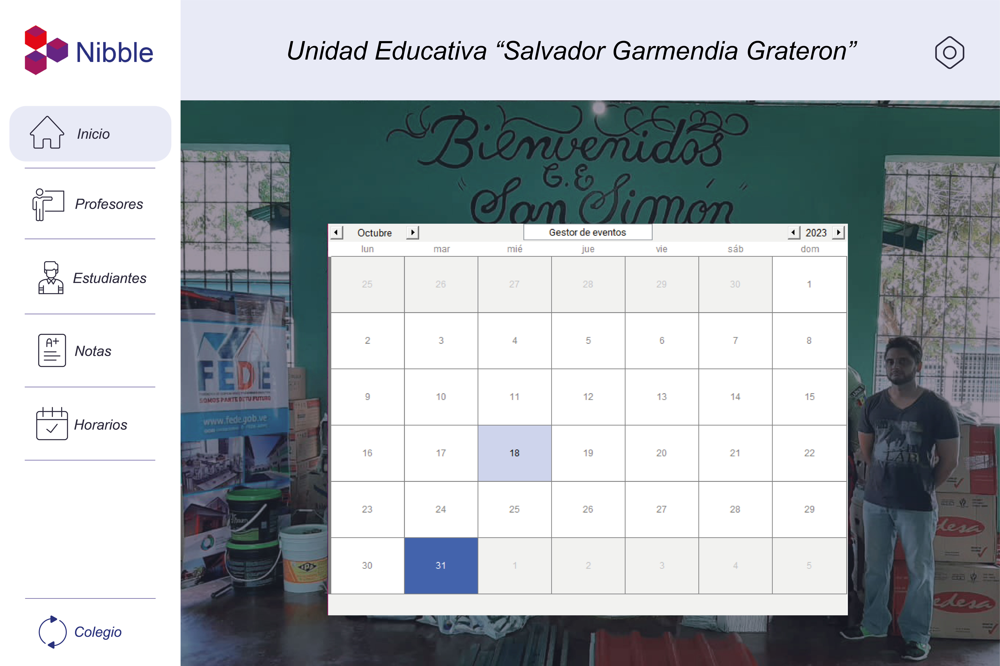
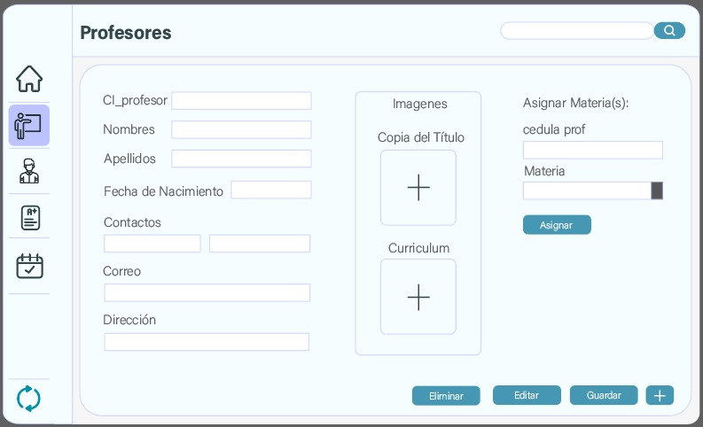
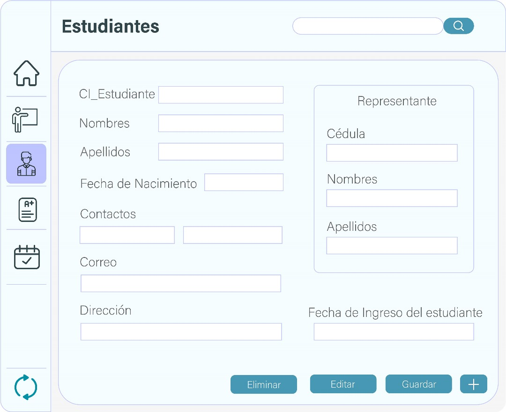

# Sistema de gestion de datos (Datahive)

> Sistema de gestion de datos (Datahive) es un sistema de gestion de datos para el grupo escolar San Simon, el cual permite gestionar los datos de los estudiantes, profesores, materias, notas, horarios, etc. El sistema esta desarrollado en Python y se conecta a una base de datos en SQLite3.

## Pantallas
```md
1. Pantalla de seleccion de modo
2. Pantalla de inicio de sesion
3. Pantalla de registro
4. Pantalla de recuperar usuario
5. Pantalla de recuperar contraseña
6. Pantalla de inicio
7. Pantalla de profesores
8. Pantalla de estudiantes
9. Pantalla de notas
10. Pantalla de horarios
11. Pantalla de Configuraciones
```
 
## Diseño de las pantallas

<div align="center">
    
    
    
    
    
</div>

<div align="center">
    
    
    
    
    
    
    
</div>

----

<h1 align="center">Desarrolladores</h1>

<a href="https://github.com/Andru0Gx">
  
</a>
<a href="https://github.com/Josue-Urbano">
  
</a>
<a href="https://github.com/ExodialGamer">
  
</a>
<a href="https://github.com/CapitanGogeta">
  
</a>
